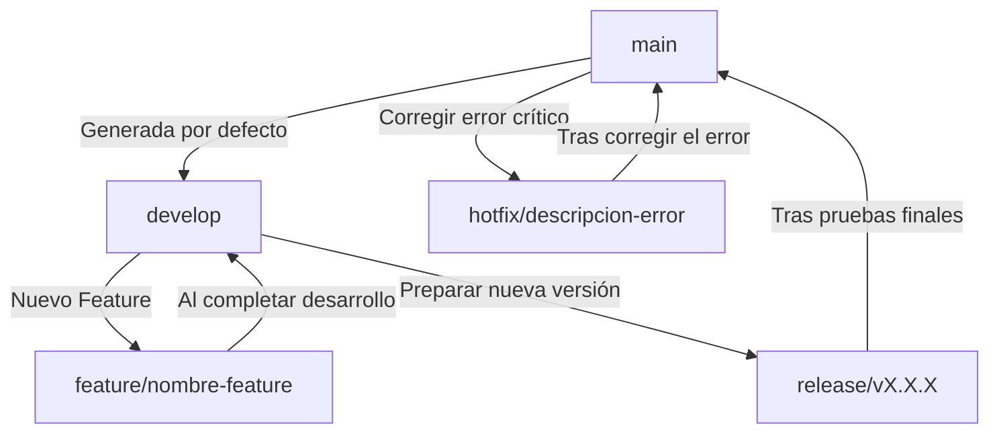
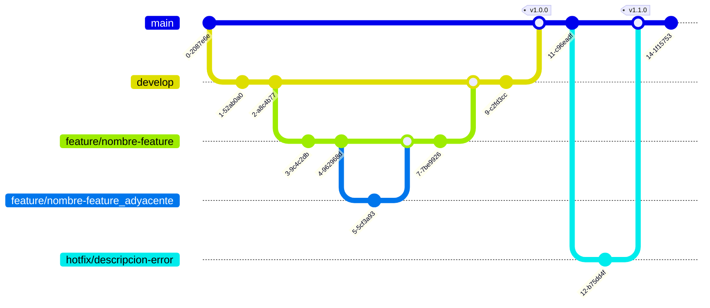
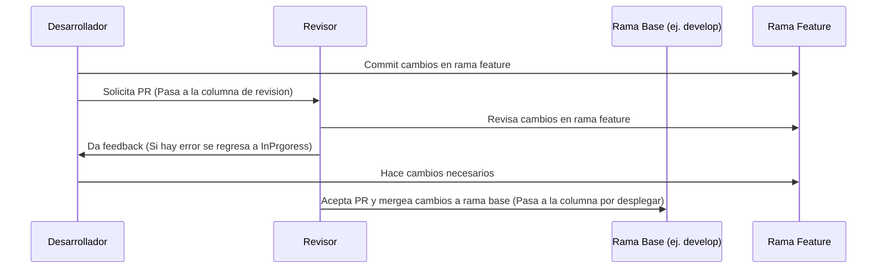

# Documentación para Ramas y PRs 

#### [Volver al índice](../README.md)

## Nomenclatura de Ramas
Para nombrar las ramas, se debe seguir la siguiente convención:

- Tipo de Rama: Este identifica la naturaleza de la rama. 
    - Ejemplos: feature/, release/, hotfix/, etc.
- Nombre de la Funcionalidad: Es el nombre de la tarea, se debe usar kebab-case (ej. nuevo-cambio).
- Dependencias de Ramas: Si una rama depende de otra rama, esta dependencia se indica con un guion bajo _ (ej. feature/nuevo-cambio-rama_adyacente).

## Gráfico de Tipos de Ramas

## Grafico ejemplo de git:

## Pull Requests (PRs)
Al hacer un Pull Request:

1. **Título**: Colocar el nombre de la rama. Si es la primera vez que se hace un PR de esa rama, sólo poner el nombre. Si no es la primera vez, separar con un guion medio `-` y agregar el motivo por el cual se hace nuevamente el PR (ej. `feature/ventana-consulta-usuarios - correcciones QA`).

